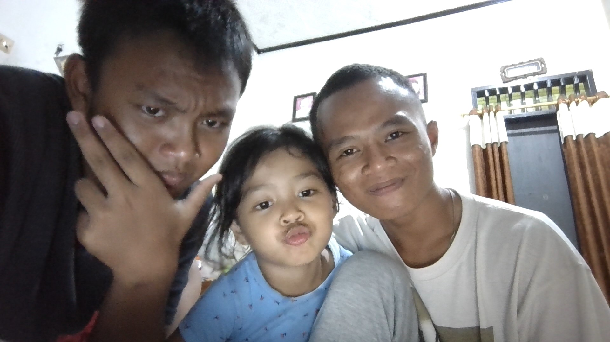

<!DOCTYPE html>
<html lang="en">
<head>
    <meta charset="UTF-8" />
    <meta name="viewport" content="width=device-width, initial-scale=1.0" />
    <link rel="stylesheet" href="style.css" />
    <title>Mochamad Naufal Bayu Nugraha</title>
</head>
<body>
    

        

            <nav>
                <ul>
                    <li><a href="">About</a></li>
                    <li><a href="">Portfolio</a></li>
                    <li><a href="">Blog</a></li>
                    <li><a href="">Contact</a></li>
                </ul>
            </nav>
        

        <main class="content">
            <section class="hero">
                
                

                    <h1>Profesi</h1>
                    <h2>Mekanik Rasya Motor</h2>
                    
Halo perkenalkan saya Mochamad Naufal Bayu Nugraha kerap disapa nopal, blog ini dibuat untuk
                        sebuah pengingat bagi diri saya dimasa depan yang sudah menikmati hasil perjuangan saya saat
                        ini. Ntah menjadi apa dirimu dimasa depan tetaplah rendah hati, jangan sombong memanusiakan
                        manusia itu harus menjadi tanggung jawab mu tapi selalu utamakan keluarga dulu ibu,ayah,adik-adiku
                        bahagiakan mereka terlebih dahulu
                    

                    <!-- Updated to include your image -->
    
    <a href="" class="action-btn">Profile Saya</a>
                

            </section>
        </main>
        

            <footer>
                <ul>
                    <li>
                        
                        <a href="#">
Instagram
</a>
                    </li>
                    <li>
                        
                        <a href="#">
Facebook
</a>
                    </li>
                    <li>
                        
                        <a href="#">
Twitter
</a>
                    </li>
                    <li>
                        
                        <a href="#">
Telegram
</a>
                    </li>
                </ul>
            </footer>
        

    

</body>
</html>
